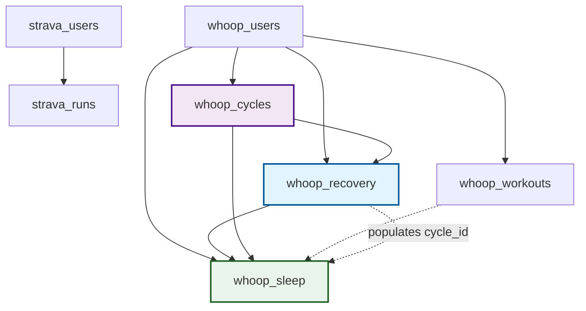

# Database Schema Documentation 📊
*Last Updated: September 15, 2025 - Zone Data Fix Applied*

## Core Concepts

**Fundamental WHOOP terminology that drives the schema design:**

* **Cycle**: A full 24-hour period in the WHOOP ecosystem, typically measured from the middle of one sleep to the middle of the next. It's the primary unit for daily analysis and the foundation for recovery calculations.

* **Strain**: A measure of cardiovascular load on a logarithmic scale of 0-21. This can be calculated for a full day (`whoop_cycles` = total daily strain) or for a specific activity (`whoop_workouts` = activity-specific strain that contributes to daily total).

* **Recovery**: A percentage (0-100%) indicating your body's readiness to perform on a given day. It is calculated during your sleep and is based on metrics like HRV, RHR, and sleep quality. Recovery is tied to a specific cycle.

## Overview

This document provides comprehensive documentation of the fitness tracking database schema, including all tables, columns, relationships, and business context. This schema supports automated data collection from Strava (running activities) and WHOOP (health metrics) with a focus on performance analysis and health insights.

**Recent Updates (September 15, 2025)**: Critical bug fixes implemented for WHOOP zone data mapping, foreign key constraints, and token refresh UX improvements. All heart rate zone data now saves correctly to the database.

## Database Structure Summary

### 📋 **Tables by Category**

**Authentication & Users (2 tables)**
- `strava_users` - Strava user profiles and API tokens
- `whoop_users` - WHOOP user profiles and API tokens

**Fitness Activities (2 tables)**
- `strava_runs` - Running activities with GPS data
- `whoop_workouts` - WHOOP workout sessions with heart rate zones

**Health Metrics (3 tables)**
- `whoop_cycles` - Daily strain and recovery cycles
- `whoop_recovery` - Recovery scores and physiological metrics
- `whoop_sleep` - Sleep performance and stage breakdowns

### 🔗 **Key Relationships**
```
strava_users ← strava_runs

whoop_users ← whoop_cycles ← whoop_recovery → whoop_sleep
whoop_users ← whoop_workouts ← whoop_sleep (via v1_id)

Recovery acts as the bridge between Cycles and Sleep due to WHOOP API v2 limitations.
```

**Relationship Details:**
- `whoop_recovery.cycle_id` → `whoop_cycles.id` (Recovery belongs to a Cycle)
- `whoop_recovery.sleep_id` → `whoop_sleep.id` (Recovery analyzes a Sleep session)
- `whoop_sleep.cycle_id` → `whoop_cycles.id` (Sleep belongs to a Cycle, populated via Recovery)
- `whoop_sleep.v1_id` → `whoop_workouts.v1_id` (Sleep may be related to a Workout)
- All tables → `whoop_users.id` (User ownership)

┌─────────────┐    ┌──────────────┐    ┌─────────────┐
│   Cycles    │    │   Recovery   │    │    Sleep    │
│             │◄───┤              ├───►│             │
│ id (PK)     │    │ cycle_id (FK)│    │ id (PK)     │
└─────────────┘    │ sleep_id (FK)│    │ cycle_id    │
                   └──────────────┘    │ v1_id (FK)  │
                                       └─────────────┘
                                              │
                                              ▼
                                       ┌─────────────┐
                                       │  Workouts   │
                                       │             │
                                       │ v1_id (UK)  │
                                       └─────────────┘
---

## Table Documentation

### 🏃‍♂️ **STRAVA_USERS** - Strava User Profiles
**Purpose**: Stores Strava user authentication and profile information  
**Data Source**: Strava OAuth + Profile API  
**Update Frequency**: On authentication and weekly sync  

| Column | Type | Required | Units | Description |
|--------|------|----------|-------|-------------|
| `id` | bigint | ✅ | - | Primary key, Strava user ID |
| `email` | varchar(255) | ❌ | - | User's email address |
| `first_name` | varchar(100) | ❌ | - | User's first name |
| `last_name` | varchar(100) | ❌ | - | User's last name |
| `username` | varchar(100) | ❌ | - | Strava username/handle |
| `city` | varchar(100) | ❌ | - | User's city location |
| `state` | varchar(100) | ❌ | - | User's state/province |
| `country` | varchar(100) | ❌ | - | User's country code |
| `sex` | varchar(1) | ❌ | - | Gender: 'M', 'F', or null |
| `profile_picture_url` | text | ❌ | - | URL to user's profile image |
| `access_token` | text | ❌ | - | Strava API access token (encrypted) |
| `refresh_token` | text | ❌ | - | Strava API refresh token (encrypted) |
| `token_expires_at` | timestamptz | ❌ | UTC | When access token expires |
| `scopes` | text | ❌ | - | Granted API permissions (read, read_all, etc.) |
| `created_at` | timestamptz | ❌ | UTC | Record creation timestamp |
| `updated_at` | timestamptz | ❌ | UTC | Last profile update timestamp |

**Business Context**: Central authentication table for Strava integration. Tokens are refreshed automatically via cron job every Monday at 1 PM.

**Data Patterns**:
- One record per Strava user
- Tokens expire every 6 hours, refreshed automatically
- Profile data updated during weekly sync

---

### 🏃‍♂️ **STRAVA_RUNS** - Running Activities
**Purpose**: Stores individual running activities with GPS and performance data  
**Data Source**: Strava Activities API  
**Update Frequency**: Weekly sync (Mondays 1 PM) + historical import  

| Column | Type | Required | Units | Description |
|--------|------|----------|-------|-------------|
| `id` | bigint | ✅ | - | Primary key, Strava activity ID |
| `user_id` | bigint | ❌ | - | Foreign key to strava_users.id |
| `name` | varchar(255) | ❌ | - | Activity name (e.g., "Morning Run") |
| `sport_type` | varchar(50) | ❌ | - | Activity type: "Run" |
| `start_date` | timestamptz | ❌ | UTC | Activity start timestamp |d
| `distance_meters` | double precision | ❌ | meters | Total distance covered |
| `summary_polyline` | text | ❌ | - | Encoded GPS polyline (low resolution) |
| `detailed_polyline` | text | ❌ | - | Encoded GPS polyline (high resolution) |
| `created_at` | timestamptz | ❌ | UTC | Record creation timestamp |
| `updated_at` | timestamptz | ❌ | UTC | Last update timestamp |

**Business Context**: Core running data for performance analysis, route tracking, and progress monitoring. GPS polylines enable route visualization and analysis.

**Data Patterns**:
- ~94 historical activities imported
- New activities added weekly
- Distance typically 1-25 km for recreational runners
- Polylines can be decoded for mapping applications

**Common Queries**:
```sql
-- Monthly running summary
SELECT DATE_TRUNC('month', start_date) as month, 
       COUNT(*) as runs, 
       SUM(distance_meters)/1000 as total_km
FROM strava_runs WHERE user_id = ? GROUP BY month;

-- Average pace by route
SELECT name, AVG(distance_meters) as avg_distance
FROM strava_runs WHERE sport_type = 'Run' GROUP BY name;
```

---

### 💪 **WHOOP_USERS** - WHOOP User Profiles
**Purpose**: Stores WHOOP user authentication and profile information  
**Data Source**: WHOOP OAuth + Profile API  
**Update Frequency**: On authentication and daily data fetch  

| Column | Type | Required | Units | Description |
|--------|------|----------|-------|-------------|
| `id` | bigint | ✅ | - | Primary key, WHOOP user ID |
| `email` | varchar(255) | ❌ | - | User's email address |
| `first_name` | varchar(255) | ❌ | - | User's first name |
| `last_name` | varchar(255) | ❌ | - | User's last name |
| `access_token` | text | ❌ | - | WHOOP API access token (encrypted) |
| `refresh_token` | text | ❌ | - | WHOOP API refresh token (encrypted) |
| `token_expires_at` | timestamptz | ❌ | UTC | When access token expires |
| `created_at` | timestamptz | ❌ | UTC | Record creation timestamp |
| `updated_at` | timestamptz | ❌ | UTC | Last profile update timestamp |

**Business Context**: Authentication table for WHOOP health data integration. Tokens refreshed automatically during daily data fetch at 3 PM.

**Data Patterns**:
- One record per WHOOP user
- Tokens expire every 24 hours, refreshed daily
- Smaller user base than Strava (premium health device)

---

### 📊 **WHOOP_CYCLES** - Daily Strain Cycles
**Purpose**: Stores daily physiological load and strain measurements  
**Data Source**: WHOOP Cycles API  
**Update Frequency**: Daily fetch at 3 PM (2 days of data)  

| Column | Type | Required | Units | Description |
|--------|------|----------|-------|-------------|
| `id` | bigint | ✅ | - | Primary key, WHOOP cycle ID |
| `user_id` | bigint | ❌ | - | Foreign key to whoop_users.id |
| `start_time` | timestamptz | ❌ | UTC | Cycle start timestamp |
| `end_time` | timestamptz | ❌ | UTC | Cycle end timestamp |
| `timezone_offset` | varchar(10) | ❌ | ±HH:MM | User's timezone offset |
| `score_state` | text | ❌ | - | "SCORED", "PENDING", or "UNSCORABLE" |
| `strain` | numeric(8,6) | ❌ | 0-21 scale | Daily strain score |
| `kilojoule` | numeric(12,4) | ❌ | kJ | Energy expenditure |
| `average_heart_rate` | integer | ❌ | BPM | Average heart rate for cycle |
| `max_heart_rate` | integer | ❌ | BPM | Maximum heart rate for cycle |

**Business Context**: Daily load measurement for recovery planning and overtraining prevention. This table contains the **total daily strain** for an entire 24-hour cycle - the cumulative cardiovascular load from all activities and daily life. Strain scores guide training intensity decisions and contribute to recovery calculations.

**Data Patterns**:
- One record per day per user
- Strain scores: 0-9 (low), 10-13 (moderate), 14-17 (high), 18-21 (very high)
- Cycles typically 24 hours but can vary with sleep schedule
- Energy expenditure correlates with strain and activity

**Typical Values**:
- Sedentary day: strain 2-6, ~1500-2000 kJ
- Active day: strain 10-15, ~2500-3500 kJ
- Heavy training: strain 16-20, ~3500+ kJ

---

### 🛌 **WHOOP_SLEEP** - Sleep Performance Data
**Purpose**: Stores detailed sleep metrics and stage breakdowns  
**Data Source**: WHOOP Sleep API  
**Update Frequency**: Daily fetch at 3 PM (2 days of data)  

| Column | Type | Required | Units | Description |
|--------|------|----------|-------|-------------|
| `id` | varchar(36) | ✅ | - | Primary key, WHOOP sleep ID (UUID) |
| `v1_id` | bigint | ❌ | - | Legacy activity ID |
| `user_id` | bigint | ❌ | - | Foreign key to whoop_users.id |
| `cycle_id` | bigint | ❌ | - | Foreign key to whoop_cycles.id |
| `start_time` | timestamptz | ❌ | UTC | Sleep start timestamp |
| `end_time` | timestamptz | ❌ | UTC | Sleep end timestamp |
| `timezone_offset` | varchar(10) | ❌ | ±HH:MM | User's timezone offset |
| `nap` | boolean | ❌ | - | True if nap, false if overnight sleep |
| `score_state` | text | ❌ | - | "SCORED", "PENDING", or "UNSCORABLE" |
| `sleep_performance_percentage` | numeric(5,2) | ❌ | 0-100% | Overall sleep performance score |
| `respiratory_rate` | numeric(5,2) | ❌ | breaths/min | Average respiratory rate |
| `sleep_consistency_percentage` | numeric(5,2) | ❌ | 0-100% | Sleep schedule consistency |
| `sleep_efficiency_percentage` | numeric(5,2) | ❌ | 0-100% | Time asleep vs time in bed |
| `total_in_bed_time_milli` | bigint | ❌ | milliseconds | Total time in bed |
| `total_awake_time_milli` | bigint | ❌ | milliseconds | Time awake during sleep period |
| `total_light_sleep_time_milli` | bigint | ❌ | milliseconds | Light sleep duration |
| `total_slow_wave_sleep_time_milli` | bigint | ❌ | milliseconds | Deep sleep duration |
| `total_rem_sleep_time_milli` | bigint | ❌ | milliseconds | REM sleep duration |
| `disturbance_count` | integer | ❌ | count | Number of sleep disturbances |

**Business Context**: Critical sleep data for recovery optimization and performance correlation. Sleep quality directly impacts training readiness and recovery scores.

**Data Patterns**:
- 1-2 records per day (overnight sleep + optional nap)
- Sleep performance 70-100% for good sleep
- Efficiency typically 85-95% for healthy adults
- Stage distribution: Light 45-55%, Deep 15-20%, REM 20-25%

**Time Conversions**:
```sql
-- Convert milliseconds to hours
SELECT total_in_bed_time_milli / 3600000.0 as hours_in_bed,
       total_light_sleep_time_milli / 3600000.0 as hours_light_sleep
FROM whoop_sleep;
```

**Typical Values**:
- Good night: 85%+ performance, 7-9 hours, <5 disturbances
- Poor night: <70% performance, <6 or >10 hours, >10 disturbances

---

### 🔋 **WHOOP_RECOVERY** - Recovery Scores
**Purpose**: Stores daily recovery metrics and physiological readiness  
**Data Source**: WHOOP Recovery API  
**Update Frequency**: Daily fetch at 3 PM (2 days of data)  

| Column | Type | Required | Units | Description |
|--------|------|----------|-------|-------------|
| `cycle_id` | bigint | ✅ | - | Primary key, foreign key to whoop_cycles.id |
| `sleep_id` | varchar(36) | ❌ | - | Foreign key to whoop_sleep.id |
| `user_id` | bigint | ❌ | - | Foreign key to whoop_users.id |
| `score_state` | text | ❌ | - | "SCORED", "PENDING", or "UNSCORABLE" |
| `recovery_score` | numeric(5,2) | ❌ | 0-100% | Overall recovery percentage |
| `resting_heart_rate` | numeric(5,2) | ❌ | BPM | Resting heart rate during sleep |
| `hrv_rmssd_milli` | numeric(8,4) | ❌ | milliseconds | Heart rate variability (RMSSD) |
| `spo2_percentage` | numeric(5,2) | ❌ | 0-100% | Blood oxygen saturation |
| `skin_temp_celsius` | numeric(4,2) | ❌ | °C | Skin temperature deviation |

**Business Context**: Primary metric for training readiness tied to daily cycles. Recovery scores guide daily training decisions and overtraining prevention. This table has a one-to-one relationship with `whoop_cycles`, providing the recovery metrics for that specific daily cycle.

**Data Patterns**:
- One record per cycle per user
- Recovery zones: Green (67-100%), Yellow (34-66%), Red (0-33%)
- Higher HRV and lower RHR typically indicate better recovery
- SpO2 typically 95-100% for healthy individuals

**Recovery Interpretation**:
- **Green (67-100%)**: Body is recovered, ready for high strain
- **Yellow (34-66%)**: Body is adapting, moderate strain recommended
- **Red (0-33%)**: Body needs rest, low strain or rest day

**Correlation Patterns**:
- High recovery + good sleep → optimal training day
- Low recovery + poor sleep → rest or easy activity
- Recovery tends to decrease with cumulative strain

---

### 🏋️‍♂️ **WHOOP_WORKOUTS** - Workout Sessions
**Purpose**: Stores individual workout sessions with heart rate zones and performance metrics  
**Data Source**: WHOOP Workouts API  
**Update Frequency**: Daily fetch at 3 PM (2 days of data)  

| Column | Type | Required | Units | Description |
|--------|------|----------|-------|-------------|
| `id` | varchar(36) | ✅ | - | Primary key, WHOOP workout ID (UUID) |
| `v1_id` | bigint | ❌ | - | Legacy activity ID |
| `user_id` | bigint | ❌ | - | Foreign key to whoop_users.id |
| `start_time` | timestamptz | ❌ | UTC | Workout start timestamp |
| `end_time` | timestamptz | ❌ | UTC | Workout end timestamp |
| `timezone_offset` | varchar(10) | ❌ | ±HH:MM | User's timezone offset |
| `sport_id` | integer | ❌ | - | WHOOP sport type ID |
| `sport_name` | varchar(100) | ❌ | - | Human-readable sport name |
| `score_state` | text | ❌ | - | "SCORED", "PENDING", or "UNSCORABLE" |
| `strain` | numeric(8,6) | ❌ | 0-21 scale | Workout strain contribution |
| `average_heart_rate` | integer | ❌ | BPM | Average heart rate during workout |
| `max_heart_rate` | integer | ❌ | BPM | Maximum heart rate during workout |
| `kilojoule` | numeric(12,4) | ❌ | kJ | Energy expenditure during workout |
| `distance_meters` | numeric(12,4) | ❌ | meters | Distance covered (if applicable) |
| `altitude_gain_meter` | numeric(12,4) | ❌ | meters | Elevation gain |
| `altitude_change_meter` | numeric(12,4) | ❌ | meters | Net elevation change |
| `zone_zero_milli` | bigint | ❌ | milliseconds | Time in zone 0 (50-60% max HR) |
| `zone_one_milli` | bigint | ❌ | milliseconds | Time in zone 1 (60-70% max HR) |
| `zone_two_milli` | bigint | ❌ | milliseconds | Time in zone 2 (70-80% max HR) |
| `zone_three_milli` | bigint | ❌ | milliseconds | Time in zone 3 (80-90% max HR) |
| `zone_four_milli` | bigint | ❌ | milliseconds | Time in zone 4 (90-95% max HR) |
| `zone_five_milli` | bigint | ❌ | milliseconds | Time in zone 5 (95-100% max HR) |

**Business Context**: Detailed workout analysis for training optimization. This table contains the **activity-specific strain** generated only during a recorded workout session. This strain value contributes to the total daily strain found in `whoop_cycles`. Heart rate zones indicate training intensity and adaptation stimulus.

**Heart Rate Zones**:
- **Zone 0 (50-60%)**: Active recovery, warm-up
- **Zone 1 (60-70%)**: Base aerobic training
- **Zone 2 (70-80%)**: Aerobic base building
- **Zone 3 (80-90%)**: Aerobic power, tempo
- **Zone 4 (90-95%)**: VO2 max, anaerobic threshold
- **Zone 5 (95-100%)**: Neuromuscular power, alactic

**Common Sport Types**:
- Running, Cycling, Swimming, Strength Training, CrossFit, etc.
- Sport ID maps to standardized activity types

**Data Patterns**:
- Multiple workouts per day possible
- Workout strain contributes to daily cycle strain
- Zone distribution indicates training focus

---

## Relationships and Data Flow

### 🔗 **Foreign Key Relationships**



### 📊 **Data Collection Flow**

**Strava Data (Weekly - Mondays 1 PM)**:
1. Refresh tokens for all Strava users
2. Fetch new activities from past week
3. Store activity details and GPS data
4. Update user profile information

**WHOOP Data (Daily - 3 PM)**:
1. Refresh tokens for all WHOOP users
2. Fetch 2 days of complete data:
   - Cycles (strain, heart rate)
   - Sleep (performance, stages)
   - Recovery (scores, HRV)
   - Workouts (heart rate zones) ✅ **FIXED**: Zone data now properly mapped from API `zone_durations` to database
3. Handle pending vs scored data states
4. **Zone Data Flow**: WHOOP API v2 `zone_durations` → Database `zone_*_milli` columns

### 🔄 **Data State Management**

**Score States**:
- `"SCORED"`: Data is complete and finalized
- `"PENDING"`: Data is being processed by WHOOP
- `"UNSCORABLE"`: Insufficient data for scoring

**Token Management**:
- Strava tokens: 6-hour expiry, weekly refresh
- WHOOP tokens: 24-hour expiry, daily refresh
- Automatic retry logic for failed refreshes

## Common Query Patterns

### 📈 **Performance Analysis Queries**

```sql
-- Monthly running progression
SELECT 
    DATE_TRUNC('month', start_date) as month,
    COUNT(*) as total_runs,
    ROUND(SUM(distance_meters)/1000, 2) as total_km,
    ROUND(AVG(distance_meters)/1000, 2) as avg_km_per_run
FROM strava_runs 
WHERE user_id = ? 
GROUP BY month 
ORDER BY month;

-- Recovery vs Running Performance
SELECT 
    sr.start_date::date as run_date,
    sr.distance_meters/1000 as km,
    wr.recovery_score,
    wr.resting_heart_rate
FROM strava_runs sr
JOIN whoop_recovery wr ON sr.start_date::date = (
    SELECT start_time::date FROM whoop_cycles WHERE id = wr.cycle_id
)
WHERE sr.user_id = ? AND wr.user_id = ?
ORDER BY sr.start_date;

-- Sleep Quality Impact on Training
SELECT 
    ws.sleep_performance_percentage,
    ws.total_in_bed_time_milli / 3600000.0 as hours_sleep,
    AVG(ww.strain) as avg_workout_strain
FROM whoop_sleep ws
JOIN whoop_workouts ww ON DATE(ws.start_time) = DATE(ww.start_time)
WHERE ws.nap = false
GROUP BY ws.id, ws.sleep_performance_percentage, hours_sleep
ORDER BY ws.sleep_performance_percentage;
```

### 🎯 **Health Correlation Queries**

```sql
-- Weekly recovery trends
SELECT 
    DATE_TRUNC('week', wc.start_time) as week,
    AVG(wr.recovery_score) as avg_recovery,
    AVG(wr.hrv_rmssd_milli) as avg_hrv,
    AVG(wr.resting_heart_rate) as avg_rhr
FROM whoop_recovery wr
JOIN whoop_cycles wc ON wr.cycle_id = wc.id
WHERE wr.user_id = ?
GROUP BY week
ORDER BY week;

-- Heart rate zone distribution
SELECT 
    sport_name,
    AVG((zone_three_milli + zone_four_milli + zone_five_milli) / 
        (zone_zero_milli + zone_one_milli + zone_two_milli + 
         zone_three_milli + zone_four_milli + zone_five_milli)::float * 100) as high_intensity_percentage
FROM whoop_workouts
WHERE user_id = ?
GROUP BY sport_name
ORDER BY high_intensity_percentage DESC;
```

## Units and Data Formats Reference

### ⏱️ **Time Fields**
- All timestamps stored in UTC (`timestamptz`)
- Duration fields in milliseconds (suffix `_milli`)
- Convert milliseconds to hours: `value / 3600000.0`
- Convert milliseconds to minutes: `value / 60000.0`

### 📏 **Distance and Physical Measurements**
- Distance: meters (convert to km: `/ 1000`)
- Altitude: meters
- Temperature: Celsius
- Heart rate: beats per minute (BPM)
- Respiratory rate: breaths per minute

### 📊 **Percentage and Score Fields**
- Recovery scores: 0-100%
- Sleep percentages: 0-100%
- Strain scores: 0-21 scale
- SpO2: 0-100% (typically 95-100%)

### 🔢 **Precision Guidelines**
- Money/Energy: 4 decimal places (`numeric(12,4)`)
- Scores/Percentages: 2 decimal places (`numeric(5,2)`)
- High precision metrics: 6 decimal places (`numeric(8,6)`)

## Embedding Generation Guidelines

### 📝 **Table Descriptions for Embeddings**

When generating embeddings for AI query understanding, use these comprehensive descriptions:

**strava_runs**: "Running activities with GPS tracking data including distance in meters, start date and time, activity name, sport type like Run or TrailRun, and encoded polyline GPS coordinates for route visualization and analysis"

**whoop_recovery**: "Daily recovery scores from 0-100 percent indicating training readiness, includes heart rate variability HRV in milliseconds, resting heart rate in BPM, blood oxygen saturation SpO2, and skin temperature in Celsius"

**whoop_sleep**: "Sleep performance data with overall percentage score, time spent in light deep and REM sleep stages in milliseconds, sleep efficiency and consistency percentages, respiratory rate, and disturbance count"

**whoop_cycles**: "Daily strain cycles measuring physiological load on 0-21 scale, includes energy expenditure in kilojoules, average and max heart rate in BPM, cycle start and end times"

**whoop_workouts**: "Individual workout sessions with sport type, strain contribution, heart rate zones 0-5 time distribution in milliseconds, distance in meters, altitude gain, and energy expenditure in kilojoules"

### 📊 **Column-Level Embedding Descriptions**

**Critical for AI precision - these detailed descriptions will be stored in the `schema_embeddings` table:**

#### WHOOP Recovery Table
| Table | Column | Description for Embedding |
|-------|---------|---------------------------|
| `whoop_recovery` | `recovery_score` | The overall recovery percentage from 0-100. Higher is better. Green zone is above 66%, yellow 34-66%, red below 34%. Use this to find how 'recovered' or 'ready' a user is. |
| `whoop_recovery` | `hrv_rmssd_milli` | Heart Rate Variability HRV in milliseconds. A key indicator of nervous system recovery and autonomic balance. Higher values typically indicate better recovery. |
| `whoop_recovery` | `resting_heart_rate` | Resting Heart Rate RHR in beats per minute, measured during sleep. Lower values generally indicate better cardiovascular fitness and recovery. |
| `whoop_recovery` | `spo2_percentage` | Blood oxygen saturation percentage, typically 95-100% for healthy individuals. Lower values may indicate respiratory issues. |
| `whoop_recovery` | `skin_temp_celsius` | Skin temperature deviation in Celsius from user's baseline. Can indicate illness, stress, or environmental factors. |

#### Strava Runs Table
| Table | Column | Description for Embedding |
|-------|---------|---------------------------|
| `strava_runs` | `distance_meters` | Total distance covered in meters. Convert to kilometers by dividing by 1000. Use for distance-based queries and performance analysis. |
| `strava_runs` | `sport_type` | Type of running activity: 'Run' for road running, 'TrailRun' for trail running, 'Treadmill' for indoor running. Use to filter activity types. |
| `strava_runs` | `start_date` | When the run started in UTC timestamp. Use for date-based filtering, trends, and time-based analysis. |
| `strava_runs` | `summary_polyline` | Encoded GPS polyline for route visualization. Low resolution but sufficient for route mapping and analysis. |
| `strava_runs` | `detailed_polyline` | High resolution encoded GPS polyline for detailed route analysis and precise mapping. |

#### WHOOP Sleep Table
| Table | Column | Description for Embedding |
|-------|---------|---------------------------|
| `whoop_sleep` | `sleep_performance_percentage` | Overall sleep performance score 0-100%. Higher is better. Use for sleep quality queries and performance correlation. |
| `whoop_sleep` | `total_in_bed_time_milli` | Total time in bed in milliseconds. Convert to hours by dividing by 3600000. Includes time awake in bed. |
| `whoop_sleep` | `total_light_sleep_time_milli` | Light sleep duration in milliseconds. Typically 45-55% of total sleep. Convert to hours or minutes as needed. |
| `whoop_sleep` | `total_slow_wave_sleep_time_milli` | Deep sleep duration in milliseconds. Critical for physical recovery. Typically 15-20% of total sleep. |
| `whoop_sleep` | `total_rem_sleep_time_milli` | REM sleep duration in milliseconds. Important for mental recovery and memory. Typically 20-25% of total sleep. |
| `whoop_sleep` | `sleep_efficiency_percentage` | Percentage of time in bed actually spent sleeping. 85-95% is typical for healthy adults. |
| `whoop_sleep` | `disturbance_count` | Number of times sleep was disturbed. Lower is better for sleep quality. |
| `whoop_sleep` | `nap` | Boolean indicating if this is a nap (true) or overnight sleep (false). Use to filter main sleep vs naps. |

#### WHOOP Cycles Table
| Table | Column | Description for Embedding |
|-------|---------|---------------------------|
| `whoop_cycles` | `strain` | Total daily strain on 0-21 scale. This is cumulative daily cardiovascular load. 0-9 low, 10-13 moderate, 14-17 high, 18-21 very high. |
| `whoop_cycles` | `kilojoule` | Energy expenditure for the entire day in kilojoules. Correlates with strain and activity level. Typical range 1500-4000+ kJ. |
| `whoop_cycles` | `average_heart_rate` | Average heart rate for the entire cycle in beats per minute. Includes all activities and rest periods. |
| `whoop_cycles` | `max_heart_rate` | Maximum heart rate reached during the cycle in beats per minute. Usually during most intense activity. |

#### WHOOP Workouts Table
| Table | Column | Description for Embedding |
|-------|---------|---------------------------|
| `whoop_workouts` | `strain` | Activity-specific strain contribution 0-21 scale. This is strain generated only during this workout, contributes to daily total. |
| `whoop_workouts` | `sport_name` | Human-readable sport type like 'Running', 'Cycling', 'CrossFit'. Use for activity type filtering and analysis. |
| `whoop_workouts` | `zone_zero_milli` | Time in heart rate zone 0 (50-60% max HR) in milliseconds. Active recovery zone. |
| `whoop_workouts` | `zone_one_milli` | Time in heart rate zone 1 (60-70% max HR) in milliseconds. Base aerobic training zone. |
| `whoop_workouts` | `zone_two_milli` | Time in heart rate zone 2 (70-80% max HR) in milliseconds. Aerobic base building zone. |
| `whoop_workouts` | `zone_three_milli` | Time in heart rate zone 3 (80-90% max HR) in milliseconds. Aerobic power, tempo zone. |

---

## Recent Database Updates (September 2025)

### ✅ **Fixed WHOOP v1_id Column Issue**
- **Problem**: `column "v1_id" of relation "whoop_sleep" does not exist` error
- **Solution**: Renamed `activity_v1_id` → `v1_id` in `whoop_sleep` table
- **Migration**: `migrations/add_relationship_whoop_sleep_workouts.sql`

### 🔗 **Enhanced Foreign Key Relationships**
- **Added**: `whoop_sleep.v1_id` → `whoop_workouts.v1_id` (for workout-related sleep)
- **Added**: `whoop_recovery.cycle_id` → `whoop_cycles.id` (ensures recovery integrity)
- **Cleaned**: Orphaned `v1_id` references set to NULL to maintain data integrity

### 📊 **Data Integrity Improvements**
- **Unique constraint**: Added to `whoop_workouts.v1_id` for proper FK references
- **Relationship validation**: All FK constraints now enforce proper WHOOP API data model
- **Bridge pattern**: Recovery table confirmed as bridge between Cycles and Sleep (per WHOOP API design)

### 🔧 **Critical Bug Fixes (September 15, 2025)**

#### **Zone Data Mapping Fix**
- **Issue**: Heart rate zone data not saving to database due to API structure mismatch
- **Root Cause**: Code expected `zone_duration` but WHOOP API v2 returns `zone_durations` (plural)
- **Fix Applied**: 
  - Updated `src/lib/db/whoop-database.ts` to use `zone_durations` (plural)
  - Fixed TypeScript types in `src/types/whoop.ts` to match API response structure
- **Impact**: All workout heart rate zone data now saves correctly
- **Validation**: Production daily fetch confirmed zone data flowing properly

#### **Foreign Key Constraint Resolution**
- **Issue**: `whoop_sleep.v1_id` foreign key constraint blocking workout saves
- **Root Cause**: WHOOP API v2 sleep/workout independence not reflected in database constraints
- **Fix Applied**: Removed foreign key constraint from `whoop_sleep.v1_id` → `whoop_workouts.v1_id`
- **Migration**: `migrations/fix_sleep_foreign_key_null.sql` - sets orphaned v1_id to NULL
- **Impact**: Sleep records can now exist independently without requiring workout relationships

#### **Token Refresh UX Improvements** 
- **Issue**: Aggressive 30-minute proactive token refresh causing premature auth warnings
- **Root Cause**: Token refresh triggered during routine page navigation vs actual expiration
- **Fix Applied**:
  - Reduced proactive refresh buffer from 30 minutes to 1 minute
  - Implemented single-warning-per-session to prevent console spam
  - Updated log messaging for clarity
- **Impact**: Users only see authentication prompts when tokens are genuinely expired

#### **Database Schema Validation**
- **Zone Data Fields**: All `zone_*_milli` columns now properly populated with millisecond values
- **Data Flow**: WHOOP API v2 → `zone_durations` → Database `zone_*_milli` columns ✅
- **Heart Rate Zones**: Complete 6-zone distribution (0-5) now captured for training analysis

| `whoop_workouts` | `zone_four_milli` | Time in heart rate zone 4 (90-95% max HR) in milliseconds. VO2 max, anaerobic threshold zone. |
| `whoop_workouts` | `zone_five_milli` | Time in heart rate zone 5 (95-100% max HR) in milliseconds. Neuromuscular power, maximum effort zone. |
| `whoop_workouts` | `distance_meters` | Distance covered during workout in meters. Convert to kilometers by dividing by 1000. Only applicable for distance-based sports. |

### 🎯 **Query Intent Categories**

1. **Performance Trends**: "show progression", "getting faster", "monthly summary"
2. **Health Correlations**: "sleep affects running", "recovery impact", "heart rate zones"
3. **Route Analysis**: "favorite routes", "distance patterns", "GPS tracking"
4. **Recovery Optimization**: "training readiness", "overtraining", "rest days"
5. **Sleep Quality**: "sleep performance", "stage distribution", "sleep consistency"

---

**✅ Schema Documentation Complete - Ready for Embedding Generation**
