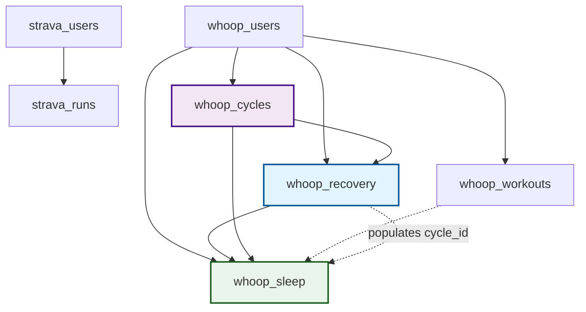

# Database Schema Documentation 📊
*Last Updated: September 15, 2025 - Zone Data Fix Applied*

## Core Concepts

**Fundamental WHOOP terminology that drives the schema design:**

* **Cycle**: A full 24-hour period in the WHOOP ecosystem, typically measured from the middle of one sleep to the middle of the next. It's the primary unit for daily analysis and the foundation for recovery calculations.

* **Strain**: A measure of cardiovascular load on a logarithmic scale of 0-21. This can be calculated for a full day (`whoop_cycles` = total daily strain) or for a specific activity (`whoop_workouts` = activity-specific strain that contributes to daily total).

* **Recovery**: A percentage (0-100%) indicating your body's readiness to perform on a given day. It is calculated during your sleep and is based on metrics like the resting heart rate (RHR), heart rate variability (HRV), and blood oxygen levels. Recovery is tied to a specific cycle. When you wake up in the morning, WHOOP calculates a Recovery score as a percentage between 0 - 100%. The higher the score, the more primed your body is to take on Strain that day.

## Overview

This document provides comprehensive documentation of the fitness tracking database schema, including all tables, columns, relationships, and business context. This schema supports automated data collection from Strava (running activities) and WHOOP (health metrics) with a focus on performance analysis and health insights.


## Database Structure Summary

### 📋 **Tables by Category**

**Authentication & Users (2 tables)**
- `strava_users` - Strava user profiles and API tokens
- `whoop_users` - WHOOP user profiles and API tokens

**Fitness Activities (3 tables)** 
- `strava_runs` - Running activities with GPS data and enhanced metrics
- `strava_run_splits` - Detailed kilometer/mile pace splits for training analysis
- `whoop_workouts` - WHOOP workout sessions with heart rate zones

**Cross-Platform Correlations (1 table)**
- `activity_correlations` - Pre-computed relationships between Strava runs and WHOOP workouts

**Health Metrics (3 tables)**
- `whoop_cycles` - Daily strain and recovery cycles
- `whoop_recovery` - Recovery scores and physiological metrics
- `whoop_sleep` - Sleep performance and stage breakdowns

### 🔗 **Key Relationships**
```
strava_users ← strava_runs ← activity_correlations → whoop_workouts → whoop_users

whoop_users ← whoop_cycles ← whoop_recovery → whoop_sleep
whoop_users ← whoop_workouts ← whoop_sleep (via v1_id)

Cross-Platform Bridge: activity_correlations connects Strava runs with WHOOP workouts using datetime matching.
Recovery acts as the bridge between Cycles and Sleep due to WHOOP API v2 limitations.
```

**Relationship Details:**
- `activity_correlations.strava_run_id` → `strava_runs.id` (Cross-platform correlation)
- `activity_correlations.whoop_workout_id` → `whoop_workouts.id` (Cross-platform correlation)
- `whoop_recovery.cycle_id` → `whoop_cycles.id` (Recovery belongs to a Cycle)
- `whoop_recovery.sleep_id` → `whoop_sleep.id` (Recovery analyzes a Sleep session)
- `whoop_sleep.cycle_id` → `whoop_cycles.id` (Sleep belongs to a Cycle, populated via Recovery)
- `whoop_sleep.v1_id` → `whoop_workouts.v1_id` (Sleep may be related to a Workout)
- All tables → respective `users.id` (User ownership)

```
WHOOP API v2 Data Relationships
═══════════════════════════════════════════════════════════════════

┌─────────────────┐     ┌─────────────────┐     ┌─────────────────┐
│   🔄 CYCLES     │     │  🔋 RECOVERY    │     │   🛌 SLEEP      │
│                 │◄────┤                 ├────►│                 │
│ id (PK)         │     │ cycle_id (FK)   │     │ id (PK)         │
│ strain          │     │ sleep_id (FK)   │     │ cycle_id (FK)   │
│ kilojoule       │     │ recovery_score  │     │ performance_%   │
│ heart_rate      │     │ hrv_rmssd_milli │     │ v1_id (FK)      │
└─────────────────┘     │ resting_hr      │     │ sleep_stages    │
                        └─────────────────┘     └─────────────────┘
                                                         │
                                                         │ (optional)
                                                         ▼
                                                ┌─────────────────┐
                                                │  🏋️ WORKOUTS   │
                                                │                 │
                                                │ v1_id (UK)      │
                                                │ strain          │
                                                │ sport_name      │
                                                │ zone_*_milli    │
                                                └─────────────────┘

Key Relationships:
• Recovery acts as bridge between Cycles ↔ Sleep (WHOOP API design)
• Each Cycle has one Recovery score based on Sleep analysis
• Sleep may optionally relate to Workouts via v1_id
• All entities belong to a user (user_id FK not shown)
```
---

## Table Documentation

### 🏃‍♂️ **STRAVA_USERS** - Strava User Profiles
**Purpose**: Stores Strava user authentication and profile information  
**Data Source**: Strava OAuth + Profile API  
**Update Frequency**: On authentication and weekly sync  

| Column | Type | Required | Units | Description |
|--------|------|----------|-------|-------------|
| `id` | bigint | ✅ | - | Primary key, Strava user ID |
| `email` | varchar(255) | ❌ | - | User's email address |
| `first_name` | varchar(100) | ❌ | - | User's first name |
| `last_name` | varchar(100) | ❌ | - | User's last name |
| `username` | varchar(100) | ❌ | - | Strava username/handle |
| `city` | varchar(100) | ❌ | - | User's city location |
| `state` | varchar(100) | ❌ | - | User's state/province |
| `country` | varchar(100) | ❌ | - | User's country code |
| `sex` | varchar(1) | ❌ | - | Gender: 'M', 'F', or null |
| `profile_picture_url` | text | ❌ | - | URL to user's profile image |
| `access_token` | text | ❌ | - | Strava API access token (encrypted) |
| `refresh_token` | text | ❌ | - | Strava API refresh token (encrypted) |
| `token_expires_at` | timestamptz | ❌ | UTC | When access token expires |
| `scopes` | text | ❌ | - | Granted API permissions (read, read_all, etc.) |
| `created_at` | timestamptz | ❌ | UTC | Record creation timestamp |
| `updated_at` | timestamptz | ❌ | UTC | Last profile update timestamp |

**Business Context**: Central authentication table for Strava integration. Tokens are refreshed automatically via cron job every Monday at 1 PM.

**Data Patterns**:
- One record per Strava user
- Tokens expire every 6 hours, refreshed automatically
- Profile data updated during weekly sync

---

### 🏃‍♂️ **STRAVA_RUNS** - Running Activities
**Purpose**: Stores individual running activities with GPS and performance data  
**Data Source**: Strava Activities API  
**Update Frequency**: Weekly sync (Mondays 1 PM) + historical import  

| Column | Type | Required | Units | Description |
|--------|------|----------|-------|-------------|
| `id` | bigint | ✅ | - | Primary key, Strava activity ID |
| `user_id` | bigint | ❌ | - | Foreign key to strava_users.id |
| `name` | varchar(255) | ❌ | - | Activity name (e.g., "Morning Run") |
| `sport_type` | varchar(50) | ❌ | - | Activity type: "Run", "TrailRun", "Treadmill" |
| `start_date` | timestamptz | ❌ | UTC | Activity start timestamp |
| `start_date_local` | timestamp | ❌ | Local | Activity start in user's local timezone |
| `utc_offset_seconds` | integer | ❌ | seconds | Timezone offset from UTC |
| `distance_meters` | double precision | ❌ | meters | Total distance covered |
| `elapsed_time_seconds` | integer | ❌ | seconds | Total elapsed time including stops |
| `average_speed_mps` | numeric | ❌ | m/s | Average speed in meters per second |
| `max_speed_mps` | numeric | ❌ | m/s | Maximum speed in meters per second |
| `total_elevation_gain` | numeric | ❌ | meters | Total elevation gained during activity |
| `elev_high` | numeric | ❌ | meters | Highest elevation point |
| `elev_low` | numeric | ❌ | meters | Lowest elevation point |
| `suffer_score` | numeric | ❌ | 0-100+ | Strava's proprietary effort metric |
| `perceived_exertion` | integer | ❌ | 1-10 | User's subjective effort rating |
| `start_latlng` | point | ❌ | lat,lng | Starting coordinates as PostgreSQL POINT |
| `end_latlng` | point | ❌ | lat,lng | Ending coordinates as PostgreSQL POINT |
| `summary_polyline` | text | ❌ | - | Encoded GPS polyline (low resolution) |
| `detailed_polyline` | text | ❌ | - | Encoded GPS polyline (high resolution) |
| `private_note` | text | ❌ | - | User's private notes about the activity |
| `created_at` | timestamptz | ❌ | UTC | Record creation timestamp |
| `updated_at` | timestamptz | ❌ | UTC | Last update timestamp |

**Business Context**: Core running data for performance analysis, route tracking, and progress monitoring. GPS polylines enable route visualization and analysis. Enhanced with detailed speed metrics, elevation data, coordinates, and subjective effort ratings for comprehensive training analysis.

**Data Patterns**:
- ~18 enhanced activities with real-time API integration
- New activities added with enhanced data collection
- Distance typically 1-25 km for recreational runners
- Coordinates stored as native PostgreSQL POINT type
- Suffer scores correlate with training intensity
- Perceived exertion provides subjective effort context

**Common Queries**:
```sql
-- Monthly running summary with enhanced metrics
SELECT DATE_TRUNC('month', start_date) as month, 
       COUNT(*) as runs, 
       SUM(distance_meters)/1000 as total_km,
       AVG(average_speed_mps * 3.6) as avg_speed_kmh,
       AVG(suffer_score) as avg_suffer_score
FROM strava_runs WHERE user_id = ? GROUP BY month;

-- Performance analysis with coordinates
SELECT name, 
       distance_meters/1000 as km,
       average_speed_mps * 3.6 as speed_kmh,
       start_latlng[0] as start_lat, start_latlng[1] as start_lng,
       suffer_score, perceived_exertion
FROM strava_runs WHERE sport_type = 'Run' ORDER BY start_date DESC;

-- Route clustering by start coordinates
SELECT name, start_latlng, 
       ST_Distance(start_latlng, ST_Point(-73.9442, 40.7580)) * 111320 as distance_from_astoria_meters
FROM strava_runs ORDER BY distance_from_astoria_meters;
```

---

### 🏃‍♂️ **STRAVA_RUN_SPLITS** - Detailed Pace Splits
**Purpose**: Stores kilometer/mile split data for detailed pace analysis  
**Data Source**: Strava Activities API (splits array)  
**Update Frequency**: Real-time with enhanced data collection  

| Column | Type | Required | Units | Description |
|--------|------|----------|-------|-------------|
| `id` | bigserial | ✅ | - | Primary key, auto-increment |
| `strava_run_id` | bigint | ✅ | - | Foreign key to strava_runs.id |
| `split_type` | text | ✅ | - | Split type: "metric" (km) or "standard" (mile) |
| `split_number` | integer | ✅ | - | Split sequence number (1, 2, 3...) |
| `distance_meters` | numeric | ✅ | meters | Split distance (1000m or 1609.34m) |
| `elapsed_time_seconds` | integer | ✅ | seconds | Total time including stops for this split |
| `moving_time_seconds` | integer | ✅ | seconds | Active movement time for this split |
| `elevation_difference_meters` | numeric | ❌ | meters | Net elevation change for this split |
| `average_speed_mps` | numeric | ✅ | m/s | Average speed for this split |
| `average_grade_adjusted_speed` | numeric | ❌ | m/s | Speed adjusted for elevation grade |
| `pace_zone` | integer | ❌ | 1-5 | Pace intensity zone for this split |

**Business Context**: Enables detailed pace analysis, training zone monitoring, and performance consistency evaluation. Critical for interval training analysis and identifying race pacing strategies.

**Data Patterns**:
- Multiple splits per run (typically 1 per km/mile)
- Metric splits (1000m) more common for international users
- Standard splits (1609.34m) for US users
- Pace zones help identify training intensity distribution
- 110+ splits currently stored across enhanced activities

**Common Split Analysis Queries**:
```sql
-- Pace progression analysis
SELECT split_number, 
       average_speed_mps * 3.6 as speed_kmh,
       elapsed_time_seconds / 60.0 as pace_per_km_minutes
FROM strava_run_splits 
WHERE strava_run_id = ? AND split_type = 'metric'
ORDER BY split_number;

-- Negative split detection (getting faster)
WITH split_halves AS (
  SELECT strava_run_id,
         CASE WHEN split_number <= MAX(split_number) OVER (PARTITION BY strava_run_id) / 2.0 
              THEN 'first_half' ELSE 'second_half' END as half,
         AVG(average_speed_mps) OVER (PARTITION BY strava_run_id, 
              CASE WHEN split_number <= MAX(split_number) OVER (PARTITION BY strava_run_id) / 2.0 
                   THEN 'first_half' ELSE 'second_half' END) as avg_speed
  FROM strava_run_splits WHERE split_type = 'metric'
)
SELECT sr.name,
       (sh2.avg_speed - sh1.avg_speed) * 3.6 as speed_improvement_kmh,
       CASE WHEN sh2.avg_speed > sh1.avg_speed 
            THEN 'Negative Split' ELSE 'Positive Split' END as split_type
FROM strava_runs sr
JOIN split_halves sh1 ON sr.id = sh1.strava_run_id AND sh1.half = 'first_half'
JOIN split_halves sh2 ON sr.id = sh2.strava_run_id AND sh2.half = 'second_half';
```

---

### 💪 **WHOOP_USERS** - WHOOP User Profiles
**Purpose**: Stores WHOOP user authentication and profile information  
**Data Source**: WHOOP OAuth + Profile API  
**Update Frequency**: On authentication and daily data fetch  

| Column | Type | Required | Units | Description |
|--------|------|----------|-------|-------------|
| `id` | bigint | ✅ | - | Primary key, WHOOP user ID |
| `email` | varchar(255) | ❌ | - | User's email address |
| `first_name` | varchar(255) | ❌ | - | User's first name |
| `last_name` | varchar(255) | ❌ | - | User's last name |
| `access_token` | text | ❌ | - | WHOOP API access token (encrypted) |
| `refresh_token` | text | ❌ | - | WHOOP API refresh token (encrypted) |
| `token_expires_at` | timestamptz | ❌ | UTC | When access token expires |
| `created_at` | timestamptz | ❌ | UTC | Record creation timestamp |
| `updated_at` | timestamptz | ❌ | UTC | Last profile update timestamp |

**Business Context**: Authentication table for WHOOP health data integration. Tokens refreshed automatically during daily data fetch at 3 PM.

**Data Patterns**:
- One record per WHOOP user
- Tokens expire every 24 hours, refreshed daily
- Smaller user base than Strava (premium health device)

---

### 📊 **WHOOP_CYCLES** - Daily Strain Cycles
**Purpose**: Stores daily physiological load and strain measurements  
**Data Source**: WHOOP Cycles API  
**Update Frequency**: Daily fetch at 3 PM (2 days of data)  

| Column | Type | Required | Units | Description |
|--------|------|----------|-------|-------------|
| `id` | bigint | ✅ | - | Primary key, WHOOP cycle ID |
| `user_id` | bigint | ❌ | - | Foreign key to whoop_users.id |
| `start_time` | timestamptz | ❌ | UTC | Cycle start timestamp |
| `end_time` | timestamptz | ❌ | UTC | Cycle end timestamp |
| `timezone_offset` | varchar(10) | ❌ | ±HH:MM | User's timezone offset |
| `score_state` | text | ❌ | - | "SCORED", "PENDING", or "UNSCORABLE" |
| `strain` | numeric(8,6) | ❌ | 0-21 scale | Daily strain score |
| `kilojoule` | numeric(12,4) | ❌ | kJ | Energy expenditure |
| `avg_heart_rate_bpm` | numeric(5,1) | ❌ | BPM | Average heart rate for cycle |
| `max_heart_rate_bpm` | numeric(5,1) | ❌ | BPM | Maximum heart rate for cycle |

**Business Context**: Daily load measurement for recovery planning and overtraining prevention. This table contains the **total daily strain** for an entire 24-hour cycle - the cumulative cardiovascular load from all activities and daily life. Strain scores guide training intensity decisions and contribute to recovery calculations.

**Data Patterns**:
- One record per day per user
- Strain scores: 0-9 (low), 10-13 (moderate), 14-17 (high), 18-21 (very high)
- Cycles typically 24 hours but can vary with sleep schedule
- Energy expenditure correlates with strain and activity

**Typical Values**:
- Sedentary day: strain 2-6, ~1500-2000 kJ
- Active day: strain 10-15, ~2500-3500 kJ
- Heavy training: strain 16-20, ~3500+ kJ

---

### 🛌 **WHOOP_SLEEP** - Sleep Performance Data
**Purpose**: Stores detailed sleep metrics and stage breakdowns  
**Data Source**: WHOOP Sleep API  
**Update Frequency**: Daily fetch at 3 PM (2 days of data)  

| Column | Type | Required | Units | Description |
|--------|------|----------|-------|-------------|
| `id` | varchar(36) | ✅ | - | Primary key, WHOOP sleep ID (UUID) |
| `v1_id` | bigint | ❌ | - | Legacy activity ID |
| `user_id` | bigint | ❌ | - | Foreign key to whoop_users.id |
| `cycle_id` | bigint | ❌ | - | Foreign key to whoop_cycles.id |
| `start_time` | timestamptz | ❌ | UTC | Sleep start timestamp |
| `end_time` | timestamptz | ❌ | UTC | Sleep end timestamp |
| `timezone_offset` | varchar(10) | ❌ | ±HH:MM | User's timezone offset |
| `is_nap` | boolean | ❌ | - | True if nap, false if overnight sleep |
| `score_state` | text | ❌ | - | "SCORED", "PENDING", or "UNSCORABLE" |
| `sleep_performance_percentage` | numeric(5,2) | ❌ | 0-100% | Overall sleep performance score |
| `respiratory_rate` | numeric(5,2) | ❌ | breaths/min | Average respiratory rate |
| `sleep_consistency_percentage` | numeric(5,2) | ❌ | 0-100% | Sleep schedule consistency |
| `sleep_efficiency_percentage` | numeric(5,2) | ❌ | 0-100% | Time asleep vs time in bed |
| `total_in_bed_time_ms` | bigint | ❌ | milliseconds | Total time in bed |
| `total_awake_time_ms` | bigint | ❌ | milliseconds | Time awake during sleep period |
| `total_light_sleep_time_ms` | bigint | ❌ | milliseconds | Light sleep duration |
| `total_slow_wave_sleep_time_ms` | bigint | ❌ | milliseconds | Deep sleep duration |
| `total_rem_sleep_time_ms` | bigint | ❌ | milliseconds | REM sleep duration |
| `disturbance_count` | integer | ❌ | count | Number of sleep disturbances |

**Business Context**: Critical sleep data for recovery optimization and performance correlation. Sleep quality directly impacts training readiness and recovery scores.

**Data Patterns**:
- 1-2 records per day (overnight sleep + optional nap)
- Sleep performance 70-100% for good sleep
- Efficiency typically 85-95% for healthy adults
- Stage distribution: Light 45-55%, Deep 15-20%, REM 20-25%

**Time Conversions**:
```sql
-- Convert milliseconds to hours
SELECT total_in_bed_time_ms / 3600000.0 as hours_in_bed,
       total_light_sleep_time_ms / 3600000.0 as hours_light_sleep
FROM whoop_sleep;
```

**Typical Values**:
- Good night: 85%+ performance, 7-9 hours, <5 disturbances
- Poor night: <70% performance, <6 or >10 hours, >10 disturbances

---

### 🔋 **WHOOP_RECOVERY** - Recovery Scores
**Purpose**: Stores daily recovery metrics and physiological readiness  
**Data Source**: WHOOP Recovery API  
**Update Frequency**: Daily fetch at 3 PM (2 days of data)  

| Column | Type | Required | Units | Description |
|--------|------|----------|-------|-------------|
| `cycle_id` | bigint | ✅ | - | Primary key, foreign key to whoop_cycles.id |
| `sleep_id` | varchar(36) | ❌ | - | Foreign key to whoop_sleep.id |
| `user_id` | bigint | ❌ | - | Foreign key to whoop_users.id |
| `score_state` | text | ❌ | - | "SCORED", "PENDING", or "UNSCORABLE" |
| `recovery_percentage` | numeric(5,2) | ❌ | 0-100% | Overall recovery percentage |
| `resting_heart_rate_bpm` | numeric(5,2) | ❌ | BPM | Resting heart rate during sleep |
| `hrv_rmssd_ms` | numeric(8,4) | ❌ | milliseconds | Heart rate variability (RMSSD) |
| `spo2_percentage` | numeric(5,2) | ❌ | 0-100% | Blood oxygen saturation |
| `skin_temp_celsius` | numeric(4,2) | ❌ | °C | Skin temperature deviation |

**Business Context**: Primary metric for training readiness tied to daily cycles. Recovery scores guide daily training decisions and overtraining prevention. This table has a one-to-one relationship with `whoop_cycles`, providing the recovery metrics for that specific daily cycle.

**Data Patterns**:
- One record per cycle per user
- Recovery zones: Green (67-100%), Yellow (34-66%), Red (0-33%)
- Higher HRV and lower RHR typically indicate better recovery
- SpO2 typically 95-100% for healthy individuals

**Recovery Interpretation**:
- **Green (67-100%)**: Body is recovered, ready for high strain
- **Yellow (34-66%)**: Body is adapting, moderate strain recommended
- **Red (0-33%)**: Body needs rest, low strain or rest day

**Correlation Patterns**:
- High recovery + good sleep → optimal training day
- Low recovery + poor sleep → rest or easy activity
- Recovery tends to decrease with cumulative strain

---

### 🏋️‍♂️ **WHOOP_WORKOUTS** - Workout Sessions
**Purpose**: Stores individual workout sessions with heart rate zones and performance metrics  
**Data Source**: WHOOP Workouts API  
**Update Frequency**: Daily fetch at 3 PM (2 days of data)  

| Column | Type | Required | Units | Description |
|--------|------|----------|-------|-------------|
| `id` | varchar(36) | ✅ | - | Primary key, WHOOP workout ID (UUID) |
| `v1_id` | bigint | ❌ | - | Legacy activity ID |
| `user_id` | bigint | ❌ | - | Foreign key to whoop_users.id |
| `start_time` | timestamptz | ❌ | UTC | Workout start timestamp |
| `end_time` | timestamptz | ❌ | UTC | Workout end timestamp |
| `timezone_offset` | varchar(10) | ❌ | ±HH:MM | User's timezone offset |
| `sport_id` | integer | ❌ | - | WHOOP sport type ID |
| `sport_name` | varchar(100) | ❌ | - | Human-readable sport name |
| `score_state` | text | ❌ | - | "SCORED", "PENDING", or "UNSCORABLE" |
| `strain` | numeric(8,6) | ❌ | 0-21 scale | Workout strain contribution |
| `avg_heart_rate_bpm` | numeric(5,1) | ❌ | BPM | Average heart rate during workout |
| `max_heart_rate_bpm` | numeric(5,1) | ❌ | BPM | Maximum heart rate during workout |
| `kilojoule` | numeric(12,4) | ❌ | kJ | Energy expenditure during workout |
| `distance_meters` | numeric(12,4) | ❌ | meters | Distance covered (if applicable) |
| `altitude_gain_meter` | numeric(12,4) | ❌ | meters | Elevation gain |
| `altitude_change_meter` | numeric(12,4) | ❌ | meters | Net elevation change |
| `hr_zone_0_ms` | bigint | ❌ | milliseconds | Time in zone 0 (50-60% max HR) |
| `hr_zone_1_ms` | bigint | ❌ | milliseconds | Time in zone 1 (60-70% max HR) |
| `hr_zone_2_ms` | bigint | ❌ | milliseconds | Time in zone 2 (70-80% max HR) |
| `hr_zone_3_ms` | bigint | ❌ | milliseconds | Time in zone 3 (80-90% max HR) |
| `hr_zone_4_ms` | bigint | ❌ | milliseconds | Time in zone 4 (90-95% max HR) |
| `hr_zone_5_ms` | bigint | ❌ | milliseconds | Time in zone 5 (95-100% max HR) |

**Business Context**: Detailed workout analysis for training optimization. This table contains the **activity-specific strain** generated only during a recorded workout session. This strain value contributes to the total daily strain found in `whoop_cycles`. Heart rate zones indicate training intensity and adaptation stimulus.

**Heart Rate Zones**:
- **Zone 0 (50-60%)**: Active recovery, warm-up
- **Zone 1 (60-70%)**: Base aerobic training
- **Zone 2 (70-80%)**: Aerobic base building
- **Zone 3 (80-90%)**: Aerobic power, tempo
- **Zone 4 (90-95%)**: VO2 max, anaerobic threshold
- **Zone 5 (95-100%)**: Neuromuscular power, alactic

**Common Sport Types**:
- Running, Cycling, Swimming, Strength Training, CrossFit, etc.
- Sport ID maps to standardized activity types

**Data Patterns**:
- Multiple workouts per day possible
- Workout strain contributes to daily cycle strain
- Zone distribution indicates training focus

---

## Relationships and Data Flow

### 🔗 **Foreign Key Relationships**



### 📊 **Data Collection Flow**

**Strava Data (Weekly - Mondays 1 PM)**:
1. Refresh tokens for all Strava users
2. Fetch new activities from past week
3. Store activity details and GPS data
4. Update user profile information

**WHOOP Data (Daily - 3 PM)**:
1. Refresh tokens for all WHOOP users
2. Fetch 2 days of complete data:
   - Cycles (strain, heart rate)
   - Sleep (performance, stages)
   - Recovery (scores, HRV)
   - Workouts (heart rate zones) ✅ **FIXED**: Zone data now properly mapped from API `zone_durations` to database
3. Handle pending vs scored data states
4. **Zone Data Flow**: WHOOP API v2 `zone_durations` → Database `zone_*_milli` columns

### 🔄 **Data State Management**

**Score States**:
- `"SCORED"`: Data is complete and finalized
- `"PENDING"`: Data is being processed by WHOOP
- `"UNSCORABLE"`: Insufficient data for scoring

**Token Management**:
- Strava tokens: 6-hour expiry, weekly refresh
- WHOOP tokens: 24-hour expiry, daily refresh
- Automatic retry logic for failed refreshes

## Common Query Patterns

### 📈 **Performance Analysis Queries**

```sql
-- Monthly running progression
SELECT 
    DATE_TRUNC('month', start_date) as month,
    COUNT(*) as total_runs,
    ROUND(SUM(distance_meters)/1000, 2) as total_km,
    ROUND(AVG(distance_meters)/1000, 2) as avg_km_per_run
FROM strava_runs 
WHERE user_id = ? 
GROUP BY month 
ORDER BY month;

-- Recovery vs Running Performance
SELECT 
    sr.start_date::date as run_date,
    sr.distance_meters/1000 as km,
    wr.recovery_percentage,
    wr.resting_heart_rate_bpm
FROM strava_runs sr
JOIN whoop_recovery wr ON sr.start_date::date = (
    SELECT start_time::date FROM whoop_cycles WHERE id = wr.cycle_id
)
WHERE sr.user_id = ? AND wr.user_id = ?
ORDER BY sr.start_date;

-- Sleep Quality Impact on Training
SELECT 
    ws.sleep_performance_percentage,
    ws.total_in_bed_time_ms / 3600000.0 as hours_sleep,
    AVG(ww.strain) as avg_workout_strain
FROM whoop_sleep ws
JOIN whoop_workouts ww ON DATE(ws.start_time) = DATE(ww.start_time)
WHERE ws.is_nap = false
GROUP BY ws.id, ws.sleep_performance_percentage, hours_sleep
ORDER BY ws.sleep_performance_percentage;
```

### 🎯 **Health Correlation Queries**

```sql
-- Weekly recovery trends
SELECT 
    DATE_TRUNC('week', wc.start_time) as week,
    AVG(wr.recovery_percentage) as avg_recovery,
    AVG(wr.hrv_rmssd_ms) as avg_hrv,
    AVG(wr.resting_heart_rate_bpm) as avg_rhr
FROM whoop_recovery wr
JOIN whoop_cycles wc ON wr.cycle_id = wc.id
WHERE wr.user_id = ?
GROUP BY week
ORDER BY week;

-- Heart rate zone distribution
SELECT 
    sport_name,
    AVG((hr_zone_3_ms + hr_zone_4_ms + hr_zone_5_ms) / 
        (hr_zone_0_ms + hr_zone_1_ms + hr_zone_2_ms + 
         hr_zone_3_ms + hr_zone_4_ms + hr_zone_5_ms)::float * 100) as high_intensity_percentage
FROM whoop_workouts
WHERE user_id = ?
GROUP BY sport_name
ORDER BY high_intensity_percentage DESC;

-- Cross-platform correlation: Strava runs with WHOOP workouts
WITH strava AS (
  SELECT
    s.*,
    s.start_date::date                    AS run_date,
    EXTRACT(HOUR FROM s.start_date)::int  AS run_hour
  FROM strava_runs AS s
),
whoop AS (
  SELECT
    w.*,
    w.start_time::date                                    AS run_date,
    EXTRACT(HOUR FROM w.start_time)::int                  AS run_hour
  FROM whoop_workouts AS w
)
SELECT 
  s.name as strava_name,
  s.distance_meters/1000 as strava_km,
  s.moving_time_seconds/60 as strava_minutes,
  w.sport_name as whoop_sport,
  w.strain as whoop_strain,
  ww.avg_heart_rate_bpm,
  ww.max_heart_rate_bpm,
  s.run_date,
  s.run_hour
FROM strava AS s
JOIN whoop AS w 
  ON s.run_date = w.run_date 
  AND s.run_hour = w.run_hour
ORDER BY w.run_date DESC;

-- Professional approach: Query correlated activities from junction table
SELECT 
  sr.name as strava_name,
  sr.distance_meters/1000 as strava_km,
  TO_CHAR(sr.start_date, 'YYYY-MM-DD HH24:MI') as strava_start,
  ww.sport_name as whoop_sport,
  ww.strain as whoop_strain,
  ww.average_heart_rate,
  COALESCE(ww.distance_meters/1000, 0) as whoop_km,
  TO_CHAR(ww.start_time, 'YYYY-MM-DD HH24:MI') as whoop_start,
  ROUND(ac.correlation_confidence::numeric, 2) as confidence,
  ac.correlation_method,
  ac.time_diff_minutes
FROM activity_correlations ac
JOIN strava_runs sr ON ac.strava_run_id = sr.id
JOIN whoop_workouts ww ON ac.whoop_workout_id = ww.id
WHERE ac.user_id = ? AND ac.correlation_confidence >= 0.75
ORDER BY sr.start_date DESC;
```

## 🔗 Cross-Platform Data Architecture

### **Professional Activity Correlation System**

For production systems, professionals use a **junction table approach** rather than real-time JOINs for cross-platform correlations:

#### **Architecture Components:**

1. **Junction Table**: `activity_correlations`
   - Stores pre-computed relationships between Strava runs and WHOOP workouts
   - Includes confidence scoring (0.0-1.0) and correlation method metadata
   - Prevents duplicate correlations with unique constraints

2. **ETL Process**: `scripts/data/run-correlation-etl.js`
   - Runs daily after data sync (Strava + WHOOP)
   - Uses multiple algorithms: datetime matching, distance correlation, confidence scoring
   - Only processes new activities to avoid recomputation

3. **Confidence Scoring**:
   - **0.95+**: Near-perfect match (≤5min time diff + distance match)
   - **0.85+**: High confidence (≤15min time diff)
   - **0.75+**: Good confidence (≤60min time diff)
   - **0.65+**: Acceptable correlation (≤120min time diff)

#### **Benefits Over Real-time JOINs:**
- **Performance**: Pre-computed relationships, no complex JOINs in queries
- **Accuracy**: Multiple correlation algorithms with confidence scoring
- **Flexibility**: Manual override capability for edge cases
- **Scalability**: ETL approach handles growing data volumes efficiently
- **Analytics**: Historical correlation patterns and method effectiveness tracking

#### **Usage:**
```bash
# Process new correlations (run daily after data sync)
node scripts/data/run-correlation-etl.js process

# Query correlations for analysis
node scripts/data/run-correlation-etl.js query 123
```

## Units and Data Formats Reference

### ⏱️ **Time Fields**
- All timestamps stored in UTC (`timestamptz`)
- Duration fields in milliseconds (suffix `_milli`)
- Convert milliseconds to hours: `value / 3600000.0`
- Convert milliseconds to minutes: `value / 60000.0`

### 📏 **Distance and Physical Measurements**
- Distance: meters (convert to km: `/ 1000`)
- Altitude: meters
- Temperature: Celsius
- Heart rate: beats per minute (BPM)
- Respiratory rate: breaths per minute

### 📊 **Percentage and Score Fields**
- Recovery scores: 0-100%
- Sleep percentages: 0-100%
- Strain scores: 0-21 scale
- SpO2: 0-100% (typically 95-100%)

### 🔢 **Precision Guidelines**
- Money/Energy: 4 decimal places (`numeric(12,4)`)
- Scores/Percentages: 2 decimal places (`numeric(5,2)`)
- High precision metrics: 6 decimal places (`numeric(8,6)`)

---

### 🔗 **ACTIVITY_CORRELATIONS** - Cross-Platform Activity Relationships
**Purpose**: Junction table storing pre-computed relationships between Strava runs and WHOOP workouts  
**Data Source**: ETL processing via correlation algorithms  
**Update Frequency**: Weekly (Monday) + real-time during data sync  

| Column | Type | Required | Units | Description |
|--------|------|----------|-------|-------------|
| `id` | bigserial | ✅ | - | Primary key, auto-increment |
| `strava_run_id` | bigint | ✅ | - | Foreign key to strava_runs.id |
| `whoop_workout_id` | varchar(36) | ✅ | - | Foreign key to whoop_workouts.id (UUID) |
| `correlation_confidence` | numeric(3,2) | ✅ | 0.00-1.00 | Confidence score of the correlation match |
| `correlation_method` | varchar(50) | ✅ | - | Algorithm used: datetime_match, datetime_distance_match, loose_datetime_match |
| `time_diff_minutes` | integer | ❌ | minutes | Time difference between activity start times |
| `distance_diff_meters` | integer | ❌ | meters | Distance difference (when both platforms have data) |
| `created_at` | timestamptz | ✅ | UTC | When correlation was established |
| `notes` | text | ❌ | - | Additional correlation metadata |

**Business Context**: Enables cross-platform analysis by connecting the same physical activity recorded on both Strava (GPS tracking) and WHOOP (physiological monitoring). This allows queries combining route data with strain metrics, heart rate zones with pace analysis, and recovery impact with training load.

**Data Patterns**:
- High confidence correlations (0.90-1.00): Same activity with precise time matching
- Medium confidence (0.70-0.89): Likely same activity with minor time differences  
- Low confidence (0.50-0.69): Possible matches requiring manual review
- Only correlations above 0.50 confidence are stored

**Correlation Methods**:
- `datetime_match`: Exact or near-exact start time matching (±1 hour)
- `datetime_distance_match`: Time + distance validation when both available
- `loose_datetime_match`: Broader time window for edge cases

**Typical Query Patterns**:
```sql
-- Get Strava route with WHOOP strain data
SELECT sr.name, sr.distance_meters, ww.strain, ww.avg_heart_rate 
FROM strava_runs sr
JOIN activity_correlations ac ON sr.id = ac.strava_run_id
JOIN whoop_workouts ww ON ac.whoop_workout_id = ww.id
WHERE ac.correlation_confidence >= 0.90;

-- Find runs with high strain but low perceived effort
SELECT sr.name, ww.strain, sr.perceived_effort_rating
FROM strava_runs sr
JOIN activity_correlations ac ON sr.id = ac.strava_run_id  
JOIN whoop_workouts ww ON ac.whoop_workout_id = ww.id
WHERE ww.strain > 15 AND sr.perceived_effort_rating < 3;
```

## Embedding Generation Guidelines

### 📝 **Table Descriptions for Embeddings**

When generating embeddings for AI query understanding, use these comprehensive descriptions:

**strava_runs**: "Running activities with GPS tracking data including distance in meters, start date and time, activity name, sport type like Run or TrailRun, and encoded polyline GPS coordinates for route visualization and analysis"

**whoop_recovery**: "Daily recovery scores from 0-100 percent indicating training readiness, includes heart rate variability HRV in milliseconds, resting heart rate in BPM, blood oxygen saturation SpO2, and skin temperature in Celsius"

**whoop_sleep**: "Sleep performance data with overall percentage score, time spent in light deep and REM sleep stages in milliseconds, sleep efficiency and consistency percentages, respiratory rate, and disturbance count"

**whoop_cycles**: "Daily strain cycles measuring physiological load on 0-21 scale, includes energy expenditure in kilojoules, average and max heart rate in BPM, cycle start and end times"

**whoop_workouts**: "Individual workout sessions with sport type, strain contribution, heart rate zones 0-5 time distribution in milliseconds, distance in meters, altitude gain, and energy expenditure in kilojoules"

**strava_run_splits**: "Detailed kilometer and mile pace splits for training analysis including split number, distance, elapsed time, moving time, average speed in meters per second, elevation difference, and pace zones for comprehensive pacing strategy evaluation"

**activity_correlations**: "Cross-platform junction table connecting Strava runs with WHOOP workouts for the same physical activity, includes confidence scores from 0.00 to 1.00, correlation methods like datetime_match, time differences in minutes, and distance differences in meters for comprehensive cross-platform analysis"

### 📊 **Column-Level Embedding Descriptions**

**Critical for AI precision - these detailed descriptions will be stored in the `schema_embeddings` table:**

#### WHOOP Recovery Table
| Table | Column | Description for Embedding |
|-------|---------|---------------------------|
| `whoop_recovery` | `recovery_percentage` | The overall recovery percentage from 0-100. Higher is better. Green zone is above 66%, yellow 34-66%, red below 34%. Use this to find how 'recovered' or 'ready' a user is. |
| `whoop_recovery` | `hrv_rmssd_ms` | Heart Rate Variability HRV in milliseconds. A key indicator of nervous system recovery and autonomic balance. Higher values typically indicate better recovery. |
| `whoop_recovery` | `resting_heart_rate_bpm` | Resting Heart Rate RHR in beats per minute, measured during sleep. Lower values generally indicate better cardiovascular fitness and recovery. |
| `whoop_recovery` | `spo2_percentage` | Blood oxygen saturation percentage, typically 95-100% for healthy individuals. Lower values may indicate respiratory issues. |
| `whoop_recovery` | `skin_temp_celsius` | Skin temperature deviation in Celsius from user's baseline. Can indicate illness, stress, or environmental factors. |

#### Strava Runs Table
| Table | Column | Description for Embedding |
|-------|---------|---------------------------|
| `strava_runs` | `distance_meters` | Total distance covered in meters. Convert to kilometers by dividing by 1000. Use for distance-based queries and performance analysis. |
| `strava_runs` | `sport_type` | Type of running activity: 'Run' for road running, 'TrailRun' for trail running, 'Treadmill' for indoor running. Use to filter activity types. |
| `strava_runs` | `start_date` | When the run started in UTC timestamp. Use for date-based filtering, trends, and time-based analysis. |
| `strava_runs` | `summary_polyline` | Encoded GPS polyline for route visualization. Low resolution but sufficient for route mapping and analysis. |
| `strava_runs` | `suffer_score` | Strava's proprietary effort metric from 0-100+. Higher values indicate greater training stress and effort. Use for training load analysis and recovery planning. |
| `strava_runs` | `perceived_exertion` | User's subjective effort rating from 1-10 scale (1=very easy, 10=maximum effort). Provides context for how hard the activity felt regardless of objective metrics. |
| `strava_runs` | `start_latlng` | Starting coordinates as PostgreSQL POINT type. Access latitude with start_latlng[0] and longitude with start_latlng[1]. Use for route analysis and location-based queries. |
| `strava_runs` | `end_latlng` | Ending coordinates as PostgreSQL POINT type. Access latitude with end_latlng[0] and longitude with end_latlng[1]. Use for route analysis and destination pattern identification. |
| `strava_runs` | `average_speed_mps` | Average speed in meters per second. Multiply by 3.6 to convert to km/h or by 2.237 to convert to mph. Use for pace and performance analysis. |
| `strava_runs` | `total_elevation_gain` | Total elevation gained during activity in meters. Critical for understanding route difficulty and training stress from climbs. |

#### Strava Run Splits Table
| Table | Column | Description for Embedding |
|-------|---------|---------------------------|
| `strava_run_splits` | `split_number` | Sequential split number (1, 2, 3, etc.) representing order within the run. Use for analyzing pace progression and identifying fastest/slowest segments. |
| `strava_run_splits` | `split_type` | Type of split measurement: 'metric' for kilometer splits (1000m) or 'standard' for mile splits (1609.34m). Use to filter for consistent split analysis. |
| `strava_run_splits` | `average_speed_mps` | Average speed for this split in meters per second. Convert to pace by calculating 1000/speed for minutes per kilometer. Critical for pace analysis and training zones. |
| `strava_run_splits` | `elapsed_time_seconds` | Total time for this split in seconds including any stops. Compare with moving_time_seconds to identify rest periods during the split. |
| `strava_run_splits` | `moving_time_seconds` | Active movement time for this split in seconds excluding stops. Use for pure pace analysis without rest time influence. |
| `strava_run_splits` | `elevation_difference_meters` | Net elevation change for this split in meters. Positive values indicate uphill, negative downhill. Critical for understanding pace variations due to terrain. |
| `strava_run_splits` | `pace_zone` | Training intensity zone (1-5) for this split based on pace. Zone 1=recovery, Zone 2=aerobic base, Zone 3=tempo, Zone 4=threshold, Zone 5=VO2 max. |

#### WHOOP Sleep Table
| Table | Column | Description for Embedding |
|-------|---------|---------------------------|
| `whoop_sleep` | `sleep_performance_percentage` | Overall sleep performance score 0-100%. Higher is better. Use for sleep quality queries and performance correlation. |
| `whoop_sleep` | `total_in_bed_time_ms` | Total time in bed in milliseconds. Convert to hours by dividing by 3600000. Includes time awake in bed. |
| `whoop_sleep` | `total_light_sleep_time_ms` | Light sleep duration in milliseconds. Typically 45-55% of total sleep. Convert to hours or minutes as needed. |
| `whoop_sleep` | `total_slow_wave_sleep_time_ms` | Deep sleep duration in milliseconds. Critical for physical recovery. Typically 15-20% of total sleep. |
| `whoop_sleep` | `total_rem_sleep_time_ms` | REM sleep duration in milliseconds. Important for mental recovery and memory. Typically 20-25% of total sleep. |
| `whoop_sleep` | `sleep_efficiency_percentage` | Percentage of time in bed actually spent sleeping. 85-95% is typical for healthy adults. |
| `whoop_sleep` | `disturbance_count` | Number of times sleep was disturbed. Lower is better for sleep quality. |
| `whoop_sleep` | `is_nap` | Boolean indicating if this is a nap (true) or overnight sleep (false). Use to filter main sleep vs naps. |

#### WHOOP Cycles Table
| Table | Column | Description for Embedding |
|-------|---------|---------------------------|
| `whoop_cycles` | `strain` | Total daily strain on 0-21 scale. This is cumulative daily cardiovascular load. 0-9 low, 10-13 moderate, 14-17 high, 18-21 very high. |
| `whoop_cycles` | `kilojoule` | Energy expenditure for the entire day in kilojoules. Correlates with strain and activity level. Typical range 1500-4000+ kJ. |
| `whoop_cycles` | `average_heart_rate` | Average heart rate for the entire cycle in beats per minute. Includes all activities and rest periods. |
| `whoop_cycles` | `max_heart_rate` | Maximum heart rate reached during the cycle in beats per minute. Usually during most intense activity. |

#### WHOOP Workouts Table
| Table | Column | Description for Embedding |
|-------|---------|---------------------------|
| `whoop_workouts` | `strain` | Activity-specific strain contribution 0-21 scale. This is strain generated only during this workout, contributes to daily total. |
| `whoop_workouts` | `sport_name` | Human-readable sport type like 'Running', 'Cycling', 'CrossFit'. Use for activity type filtering and analysis. |
| `whoop_workouts` | `zone_zero_milli` | Time in heart rate zone 0 (50-60% max HR) in milliseconds. Active recovery zone. |
| `whoop_workouts` | `zone_one_milli` | Time in heart rate zone 1 (60-70% max HR) in milliseconds. Base aerobic training zone. |
| `whoop_workouts` | `zone_two_milli` | Time in heart rate zone 2 (70-80% max HR) in milliseconds. Aerobic base building zone. |
| `whoop_workouts` | `zone_three_milli` | Time in heart rate zone 3 (80-90% max HR) in milliseconds. Aerobic power, tempo zone. |

---

## Recent Database Updates (September 2025)

### 🚀 **Enhanced Strava Data Collection (September 17, 2025)**
- **New Table**: Added `strava_run_splits` for detailed kilometer/mile pace analysis
- **Enhanced Fields**: Added coordinates (`start_latlng`, `end_latlng` as PostgreSQL POINT), speed metrics, elevation data, suffer scores to `strava_runs`
- **Real-time Integration**: Implemented enhanced data collection with `fetch-real-enhanced-data.js` as main production script
- **Data Volume**: 18 activities with enhanced data, 110+ splits properly normalized

### 🔗 **Cross-Platform Activity Correlations**
- **Junction Table**: Added `activity_correlations` for professional cross-platform analysis
- **Confidence Scoring**: Implemented 0.00-1.00 confidence scoring with multiple correlation methods
- **ETL Process**: Added automated correlation processing via `run-correlation-etl.js`
- **Method Support**: datetime_match, datetime_distance_match, loose_datetime_match algorithms

### 📊 **Database Schema Standardization**
- **Column Naming**: Standardized all heart rate columns to `*_bpm` format
- **Time Fields**: Unified all duration fields to `*_ms` (milliseconds) format
- **Coordinates**: Native PostgreSQL POINT type for optimal geographic queries
- **Relationships**: Proper foreign key constraints enforcing WHOOP API v2 data model

### 🎯 **Current Data Inventory (September 17, 2025)**

#### **Tables Summary (9 tables total)**
- **Authentication**: `strava_users`, `whoop_users` (2 tables)
- **Fitness Activities**: `strava_runs`, `strava_run_splits`, `whoop_workouts` (3 tables)
- **Health Metrics**: `whoop_cycles`, `whoop_recovery`, `whoop_sleep` (3 tables)
- **Cross-Platform**: `activity_correlations` (1 table)

#### **Data Volume**
- **Strava**: 18 enhanced activities with full metrics and coordinates
- **Splits**: 110+ pace splits for detailed training analysis
- **WHOOP**: Complete physiological data with heart rate zones properly populated
- **Correlations**: Cross-platform activity matching with confidence scoring

#### **Schema Validation**
All tables match production database schema exactly:
- Column names standardized (`*_bpm`, `*_ms` formats)
- PostgreSQL POINT coordinates for geographic queries
- Proper foreign key relationships enforcing data integrity
- Enhanced fields fully populated via real-time API integration

| `whoop_workouts` | `zone_four_milli` | Time in heart rate zone 4 (90-95% max HR) in milliseconds. VO2 max, anaerobic threshold zone. |
| `whoop_workouts` | `zone_five_milli` | Time in heart rate zone 5 (95-100% max HR) in milliseconds. Neuromuscular power, maximum effort zone. |
| `whoop_workouts` | `distance_meters` | Distance covered during workout in meters. Convert to kilometers by dividing by 1000. Only applicable for distance-based sports. |

#### Activity Correlations Table
| Table | Column | Description for Embedding |
|-------|---------|---------------------------|
| `activity_correlations` | `correlation_confidence` | Confidence score from 0.00 to 1.00 indicating how certain this Strava run matches this WHOOP workout. Values above 0.90 are highly reliable, 0.70-0.89 are likely matches, below 0.70 may need review. Use to filter for reliable cross-platform data. |
| `activity_correlations` | `correlation_method` | Algorithm used to establish the correlation: 'datetime_match' for time-based matching, 'datetime_distance_match' for time plus distance validation, 'loose_datetime_match' for broader time windows. Helps understand correlation reliability. |
| `activity_correlations` | `time_diff_minutes` | Time difference in minutes between Strava run start and WHOOP workout start. Values near 0 indicate exact time matches. Negative values mean WHOOP started before Strava. |
| `activity_correlations` | `strava_run_id` | Foreign key linking to the Strava run record. Use to JOIN with strava_runs table for GPS data, route information, perceived effort, and pace metrics. |
| `activity_correlations` | `whoop_workout_id` | Foreign key linking to the WHOOP workout record. Use to JOIN with whoop_workouts table for strain data, heart rate zones, and physiological metrics. |

### 🎯 **Query Intent Categories**

1. **Performance Trends**: "show progression", "getting faster", "monthly summary"
2. **Health Correlations**: "sleep affects running", "recovery impact", "heart rate zones"
3. **Route Analysis**: "favorite routes", "distance patterns", "GPS tracking"
4. **Recovery Optimization**: "training readiness", "overtraining", "rest days"
5. **Sleep Quality**: "sleep performance", "stage distribution", "sleep consistency"

---

**✅ Schema Documentation Complete - Updated September 17, 2025**

This documentation now accurately reflects the current production database schema with all enhanced fields, proper column names, and complete table relationships. Ready for embedding generation and AI query understanding.
